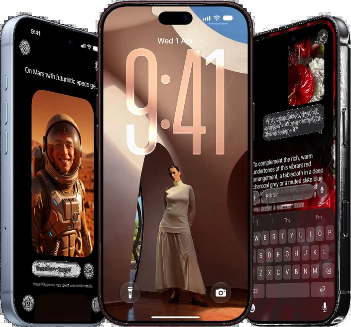

<div align="center">

# 📱 Antigravity Store - iPhone 18 Pro Experience

<a href="https://antigravity-store-ten.vercel.app">
  
</a>

*A breathtaking, high-performance eCommerce landing page inspired by Apple's premium design language. Completely lag-free, hyper-optimized, and built for the future.*

<br />

<!-- Dynamic GitHub Badges (Will populate once pushed to GitHub) -->
[](https://github.com/juzer09jawadwala-source/antigravity-store/stargazers)
[](https://github.com/juzer09jawadwala-source/antigravity-store/network/members)
[](https://github.com/juzer09jawadwala-source/antigravity-store/pulls)
[](https://github.com/juzer09jawadwala-source/antigravity-store/issues)
[](https://github.com/juzer09jawadwala-source/antigravity-store/blob/main/LICENSE)
[](https://antigravity-store-ten.vercel.app)

<!-- Tech Stack Badges -->
[](#)
[](#)
[](#)
[](#)

<br />

### 🔗 [View Live Demo](https://antigravity-store-ten.vercel.app)

</div>

---

## ✨ Features

- **Apple-Grade Visuals:** Meticulously crafted layouts mirroring the premium, dark-mode-first design language of modern tech giants.
- **Lightning Fast Performance:** A 55MB+ asset payload completely optimized and converted to lightweight `WebP`, delivering a visually stunning site with zero scroll lag.
- **Seamless Integrations:**
  - Siri / Apple Intelligence Hero showcase with flawless alpha-masking.
  - Vapor Chamber graphics with AI-assisted background removal and CSS radial blending.
  - Edge-to-edge full-width product imagery.
- **Fluid Animations:** Component-level scroll triggers, parallax carousels, and smooth reveals using Framer Motion and Tailwind.
- **Mobile First:** Responsive grids and text scaling ensuring the "pro" experience translates perfectly to any screen size.

## 🛠 Tech Stack

- **Framework:** [Next.js 14](https://nextjs.org/) (App Router)
- **Language:** [TypeScript](https://www.typescriptlang.org/)
- **Styling:** [Tailwind CSS](https://tailwindcss.com/)
- **Animations:** [Framer Motion](https://www.framer.com/motion/)
- **Deployment:** [Vercel](https://vercel.com/)
- **Image Optimization:** Python (Pillow, rembg) for Next-Gen `WebP` compression

## 🚀 Getting Started

To run this project locally, follow these steps:

### Prerequisites

- Node.js 18.17 or later
- npm, yarn, or pnpm

### Installation

1. Clone the repository:
   ```bash
   git clone https://github.com/juzer09jawadwala-source/antigravity-store.git
   cd antigravity-store
   ```

2. Install dependencies:
   ```bash
   npm install
   # or
   yarn install
   ```

3. Run the development server:
   ```bash
   npm run dev
   # or
   yarn dev
   ```

4. Open [http://localhost:3000](http://localhost:3000) with your browser to see the result.

## 📂 Project Structure

```text
antigravity-store/
├── app/                  # Next.js App Router and main pages
├── components/           # Reusable UI components
│   ├── sections/         # Major page sections (Hero, SiriAi, VaporChamber, etc.)
│   └── ui/               # Granular interactive components (Carousels, Cards)
├── public/               # Highly optimized WebP assets
└── styles/               # Global CSS and Tailwind configurations
```

## 📈 Performance Journey

During development, the site underwent a massive performance audit. Over 50MB of heavy uncompressed product images (PNG/JPG) were batch-converted to `WebP` and wrapped in `next/image` attributes and native lazy loading. 

Additionally, custom AI scripts (`rembg`) were used to isolate product graphics (like the Siri orb and internal Vapor Chamber) to allow seamless `#000000` blending via CSS `mask-image`, removing ugly clipping boxes entirely.

## 🤝 Contributing

Contributions, issues and feature requests are welcome!
Feel free to check [issues page](https://github.com/juzer09jawadwala-source/antigravity-store/issues). 

## 📝 License

This project is [MIT](LICENSE) licensed.

---
<div align="center">
  <sub>Built with ❤️ by the Antigravity Team.</sub>
</div>
